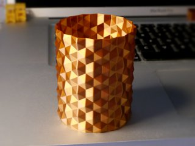
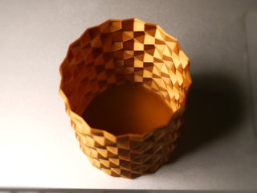
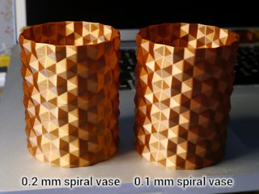

# Hex surface vase (spiral print)
*3D printable vase, pen holder, or general container with hexagonal surface (formerly thing:2906756)*

### License
[Creative Commons - Attribution](https://creativecommons.org/licenses/by/4.0/)

### Gallery

[🔎](images/photo1.jpg) [🔎](images/photo2.jpg) [🔎](images/photo3.jpg)

## Description and Instructions

I was sure I have seen a model like this on Thingiverse but I couldn't find it, so I created my own. Of course, after printing I somehow thought of searching for ‘honeycomb’ and finally found [the thing I remembered](https://www.thingiverse.com/thing:891147), which is similar but different.

This is intended to be printed in ‘spiral vase’ mode which prints a single seamless wall in one continuous movement. The radius of the models is about 53 mm, scale it up or down as you see fit.

Due to the many facets this looks particularly nice in shiny filaments, like the ‘silky copper’ from 3D Eksperten as shown in the photos.

This was created by doing some calculations, then drawing polygons from scratch in Blender, and repeating them. The different size models were simply created by making one very long model and then cutting it into parts of different lengths.

### Printing

‘Spiral vase’ mode (as it is called in Slic3r and PrusaSlicer) has different names in different slicing programs: Cura calls it “Spiralize outer contour” (may need to be activated in the preferences), in S3D it is “Corkscrew/vase.” It is not mandatory for printing this model, but provides the nicest results when printing with a single shell.

You can also print it without spiral mode by setting infill to 0% and zero top layers. This allows to print with more shells for extra strength, but it will produce a visible seam unless you enable random contour starting points in your slicer.

For a really smooth finish on smaller prints, print in spiral vase mode with 0.1 mm layers. 0.2 mm is good for larger sizes.

The 0.2 mm print in the comparison photo has some artifacts because the ‘ensure vertical shell thickness’ option was enabled in Slic3r, which may cause it to switch back to regular layers at random points. Make sure this option is not enabled when printing in spiral vase mode.

## Updates

### 2018/05/12
First published on Thingiverse.

### 2021/03/27
Added two taller models. If you want a model of specific height, you can chop up the tallest HexSurfaceVase6 model to your likings in any mesh editor, or use your slicer's cut feature if it has one.

### 2022/02/21
Migrated to GitHub because Thingiverse is getting more unusable each day. Please stop using Thingiverse, its glory days are long gone and its current owners are greedy parasites.

## TAGS
`faceted`, `hex`, `hexagon`, `honeycomb`, `spiral vase`, `spiral vase printing`, `vase`
